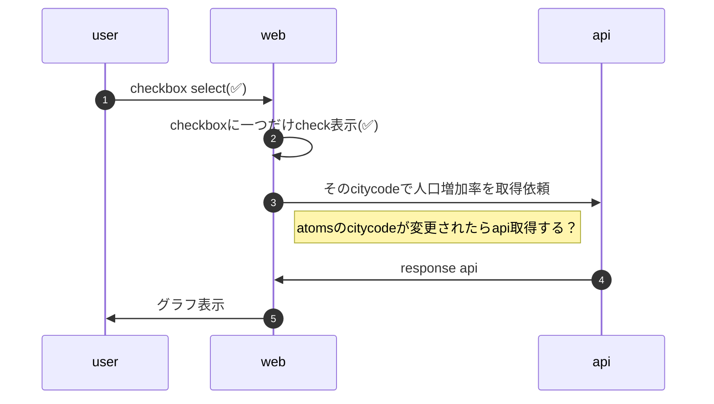
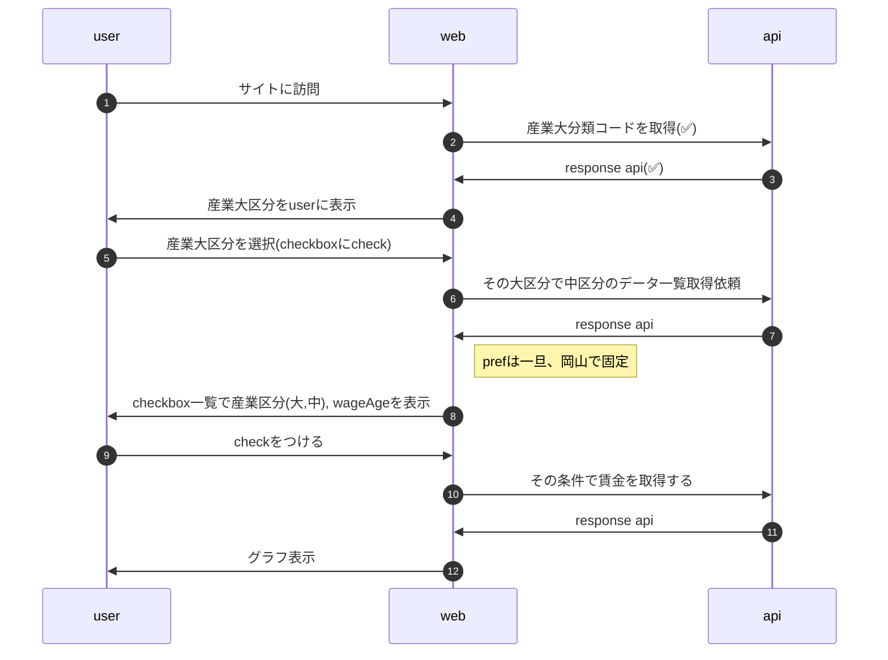

### 人口増減グラフ

```mermaid
sequenceDiagram
    autonumber
    participant user
    participant web
    participant api
    user->>web: checkbox select(✅)
	web->>web: checkboxに一つだけcheck表示(✅)
	web->>api: そのcitycodeで人口増加率を取得依頼
	Note right of web: atomsのcitycodeが変更されたらapi取得する？
	api->>web: response api
	web->>user: グラフ表示
```

### 賃金グラフ

```mermaid
sequenceDiagram
    autonumber
    participant user
    participant web
    participant api
    user->>web: サイトに訪問
	web->>api: 産業大分類コードを取得(✅)
	api->>web: response api(✅)
	web->>user: 産業大区分をuserに表示
	user->>web: 産業大区分を選択(checkboxにcheck)
	web->>api: その大区分で中区分のデータ一覧取得依頼
	api->>web: response api
	Note right of web: prefは一旦、岡山で固定
	web->>user: checkbox一覧で産業区分(大,中), wageAgeを表示
	user->>web: checkをつける
	web->>api: その条件で賃金を取得する
	api->>web: response api
	web->>user: グラフ表示
```
