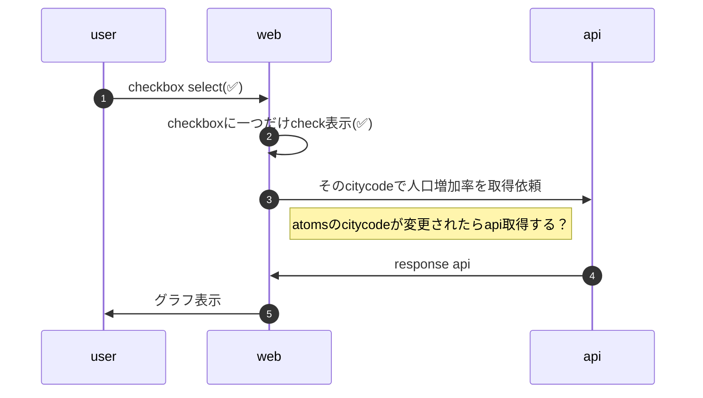

### グラフ作成

```mermaid
sequenceDiagram
    autonumber
    participant user
    participant web
    participant api
    user->>web: checkbox select(✅)
	web->>web: checkboxに一つだけcheck表示(✅)
	web->>api: そのcitycodeで人口増加率を取得依頼
	Note right of web: atomsのcitycodeが変更されたらapi取得する？
	api->>web: response api
	web->>user: グラフ表示
```
